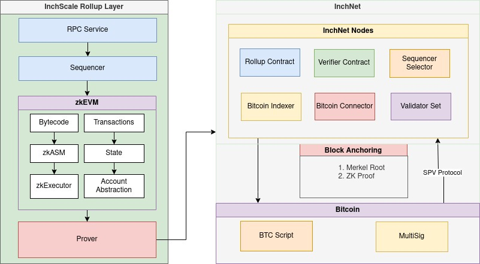
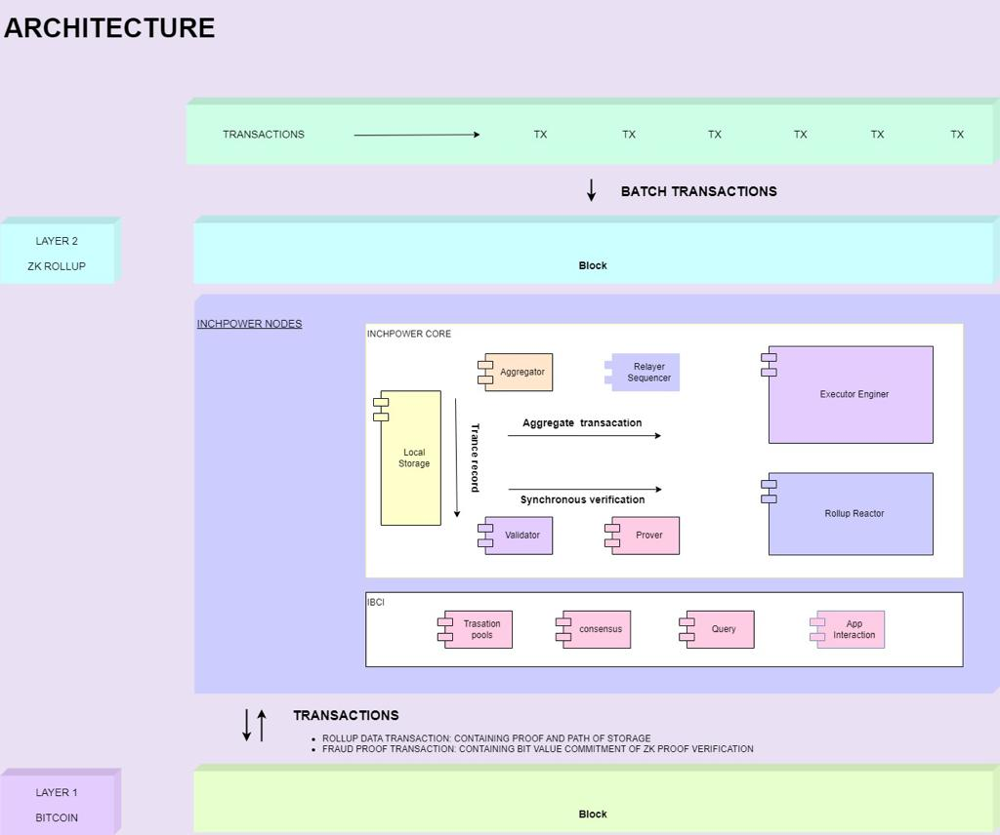

# InchPower - Bitcoin Layer 2 Blockchain Project

**Version**: 0.1.0  
**Release Date**: November 17, 2023



## Table of Contents

1. [Introduction](#1-introduction)
2. [Features](#2-features)
3. [Getting Started](#3-getting-started)
    - [Installation](#installation)
    - [Usage](#usage)
4. [Project Structure](#4-project-structure)
5. [System Architecture](#5-system-architecture)
6. [InchPower Node Structure](#6-node-structure)
7. [Conclusion](#7-conclusion)
8. [Acknowledgments](#8-acknowledgments)
9. [License](#9-license)

## 1. Introduction

InchPower is a Bitcoin Layer 2 solution designed to transform Bitcoin into a utility token while maintaining its value-anchored nature. The project focuses on providing a trustworthy and secure environment for Bitcoin holders to use their assets without bridging to other blockchains. InchPower offers a comprehensive security guarantee, supporting rapid unbundling to maximize liquidity and income for Bitcoin holders.

## 2. Features

- **Bitcoin Nativeness:** InchPower ensures full compatibility with the Bitcoin ecosystem, using BTC as gas fees to maintain purity.
- **Security:** Utilizes a two-way mandatory binding architecture to inherit the security finality of Bitcoin, preventing long-range attacks.
- **Zk-Proof Efficient Expansion:** Implements zero-knowledge proofs for faster transaction speeds and lower costs without compromising security.
- **Modular Layer 2 Solution:** InchPower provides a modular SDK for building Bitcoin Layer 2 blockchains, allowing developers to build decentralized applications (Dapps) efficiently.

## 3. Getting Started

### Installation


```bash
git clone https://github.com/edward1christian/inchpower-monorepo.git
cd inchpower-monorepo
npm install 
```
### Usage

```bash
```
## 4. Project Structure

The InchPower project is organized into the following packages:

1. **common:** Shared utilities and modules used across multiple packages.
2. **consensus:** Implementation of different consensus algorithms as modular plug-ins.
3. **contracts:** Smart contracts and decentralized applications (Dapps) built on the InchPower platform.
4. **executor:** Core execution engine for processing transactions and smart contracts.
5. **network-proof:** Implementation of zero-knowledge proofs for efficient network communication.
6. **relay:** Relay nodes responsible for communication between off-chain and on-chain components.
7. **sequencer:** Transaction sequencer for ordering and processing transactions efficiently.
8. **validator:** Validators responsible for validating transactions and ensuring network security.

## 5. System Architecture

### 5.1 InchPower Architecture



## 6. InchPower Node Structure

The core data structure in InchPower is the `Node` structure, which is the entry point for node functionality. The key fields include:

- **service.BaseService:** Provides basic functions of the service, such as start, stop, reset, etc.
- **config *cfg.Config:** Stores configuration information for the node.
- **genesisDoc *types.GenesisDoc:** The initial state of the blockchain, used to initialize the chain state.
- ...

For detailed information on each field and its functions, refer to the source code.

## 7. Conclusion

InchPower introduces a novel use case for Bitcoin, turning it into a programmable Bitcoin Layer 2 platform. The project addresses scalability challenges, empowers smart contracts and Dapps, and provides a competitive solution in the Bitcoin ecosystem.

## 8. Acknowledgments

The InchPower project is a collaborative effort among the InchPower Core Team.

## 9. License

This project is licensed under the [MIT License](./LICENSE).
